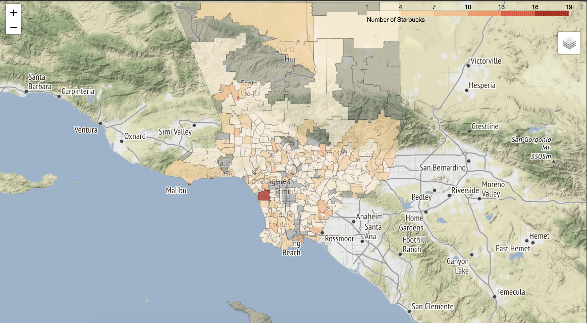

# Interactive Maps with Folium!
Sophie Spiliotopoulos 
IDCE 30274 Lab 6

This tutorial uses a Python library called [Folium](https://python-visualization.github.io/folium/), which builds on a common web mapping javascript library called [Leaflet](https://leafletjs.com/).
This lab works through creating a new dataframe using pandas, creating interactive chlorpleth and point maps, and discusses when to use chloropleth maps. 
The script for this lab  can be found in the attached Colab notebook. 

Check out a screen shot of one of the maps here 👇

